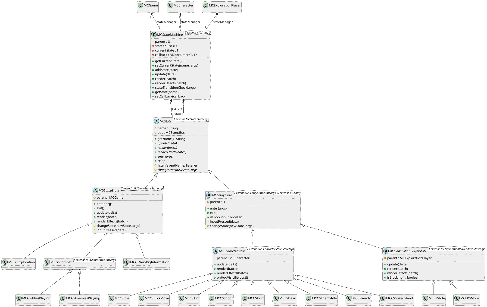
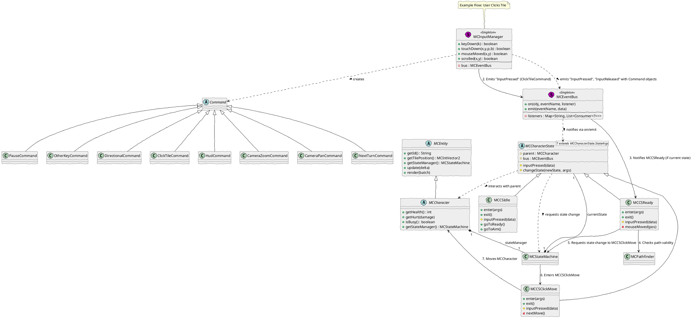
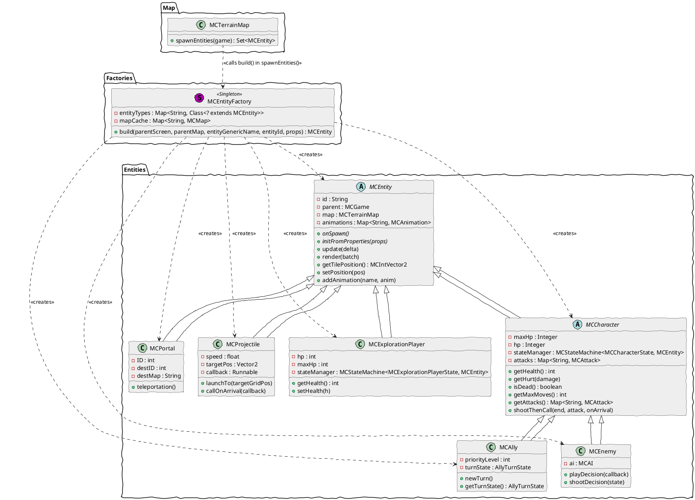
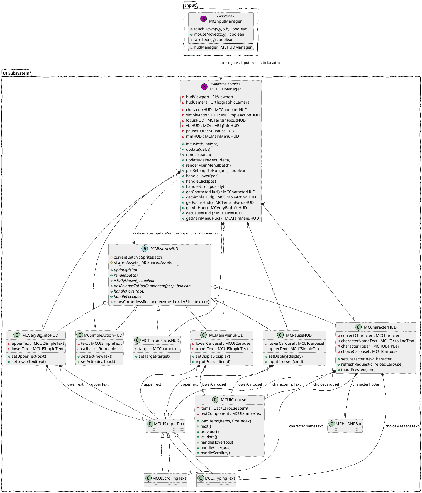

Voici le chapitre "Architecture Technique et Conception" de votre rapport final de projet de moteur de jeu. Il est rédigé en français, en Markdown, et respecte scrupuleusement la structure et les exigences de détail demandées.

---

# Architecture Technique et Conception

Ce chapitre détaille l'architecture technique et les choix de conception qui sous-tendent le moteur de jeu, en analysant sa structure globale, les Design Patterns implémentés et les interactions entre ses composants clés. L'objectif est de fournir une compréhension exhaustive du fonctionnement interne du système, de ses modules principaux à la granularité des Design Patterns.

## 1. Architecture Générale du Moteur (Vue Macroscopique)

L'architecture du moteur de jeu est conçue pour être modulaire, extensible et réactive, s'appuyant sur des principes de découplage et de gestion d'état pour orchestrer les différentes phases du jeu.

### Le Cycle de Vie (Core Loop)

Le cœur du moteur est encapsulé dans la classe `MCGame`, qui étend `com.badlogic.gdx.Game` et implémente l'interface `ApplicationListener` de LibGDX. Cette classe agit comme le point d'entrée principal et l'orchestrateur du cycle de vie de l'application.

Le démarrage du jeu est initié par la méthode `create()`. C'est ici que tous les sous-systèmes majeurs sont initialisés. `SpriteBatch` et `FitViewport` sont configurés pour la gestion de l'affichage. Les singletons essentiels tels que `MCPathfinder`, `MCSharedAssets`, `MCCameraManager`, `MCInputManager`, `MCEntityFactory`, `MCAttackFactory` et `MCHUDManager` sont instanciés et initialisés, souvent en leur passant des références à `MCGame` ou à l'AssetManager (`drh`) pour qu'ils puissent interagir avec le contexte global du jeu et charger leurs ressources. Par exemple, `MCSharedAssets` charge les textures et polices communes, tandis que `MCEntityFactory` précharge les définitions d'entités. La machine à états principale du jeu (`stateManager`) est également configurée avec ses états initiaux, et la première carte (`start.tmx`) est chargée via `loadMap()`. Enfin, l'écran de jeu initial (`MCGameScreen`) est défini, et le `MCEventBus` est abonné à des événements globaux comme "MainMenu", "Pause", "Resume" et "Quit" pour gérer les transitions d'état de l'application.

La boucle de rendu principale est gérée par la méthode `render(float delta)`. Cette méthode est appelée à chaque frame par le framework LibGDX. Elle commence par calculer un `delta` temps plafonné à `0.1f` pour éviter des comportements instables en cas de ralentissements extrêmes. La logique du jeu est ensuite mise à jour via `logic(delta)`. Cette fonction est cruciale car elle orchestre les mises à jour de la caméra (`camManager.update`), de la machine à états du jeu (`stateManager.update`), du gestionnaire d'entités (`entityManager.update`) et du gestionnaire d'HUD (`hudManager.update`). Après la mise à jour de la logique, la méthode `super.render()` est appelée, ce qui délègue le rendu à l'écran (`Screen`) actuellement actif (par exemple, `MCGameScreen` ou `MCMainMenuScreen`). L'écran actif est responsable de vider le tampon d'écran, de rendre la carte du terrain, puis toutes les entités et enfin l'interface utilisateur.

La gestion du temps est centrale, le paramètre `delta` représentant le temps écoulé depuis la dernière frame. Il est utilisé de manière cohérente dans toutes les méthodes `update()` des entités, des états et des gestionnaires pour garantir que les animations, les mouvements et les logiques de jeu progressent à une vitesse indépendante de la fréquence d'images.

Enfin, la méthode `dispose()` est appelée à la fin du cycle de vie de l'application pour libérer toutes les ressources allouées, telles que la carte du terrain (`map.dispose()`), évitant ainsi les fuites de mémoire.

### La Machine à États (State Management)

La gestion des différents modes et phases du jeu est implémentée via une architecture de machine à états robuste, centrée autour de la classe générique `MCStateMachine<T extends MCState, U>`. Ce pattern est appliqué à deux niveaux principaux : la gestion des états globaux du jeu et la gestion des états spécifiques aux entités.

Au niveau global, `MCGame` possède une instance de `MCStateMachine<MCGameState, MCGame>` nommée `stateManager`. Cette machine gère les transitions entre des états de jeu de haut niveau, tels que `MCGSExploration` (mode exploration libre), `MCGSAlliesPlaying` (phase de jeu des alliés en combat), `MCGSEnemiesPlaying` (phase de jeu des ennemis en combat) et `MCGSVeryBigInformation` (affichage d'informations importantes, comme la victoire/défaite). Chaque état de jeu hérite de `MCGameState`, qui fournit une interface commune pour les méthodes `enter()`, `exit()`, `update(float delta)` et `render(SpriteBatch batch)`. La méthode `enter()` est appelée lors de l'entrée dans un état, permettant d'initialiser les écouteurs d'événements, de configurer la caméra ou l'HUD. `exit()` est appelée lors de la sortie, pour nettoyer les ressources ou désabonner les écouteurs. `update()` et `render()` sont appelées à chaque frame pour la logique et l'affichage spécifiques à l'état.

La transition entre ces états est gérée par la méthode `setCurrentState(String name, T.StateArgs args)` de `MCStateMachine`. Cette méthode assure une transition propre en appelant `exit()` sur l'état précédent, puis `enter()` sur le nouvel état avec les arguments nécessaires (`StateArgs`). Un mécanisme de `TransitionArgs` est utilisé pour encapsuler les informations de transition, permettant des vérifications et des callbacks (`BiConsumer<T, T> callback`) lors des changements d'état.

De manière similaire, chaque `MCEntity` (et plus spécifiquement `MCCharacter` et `MCExplorationPlayer`) possède sa propre `MCStateMachine` pour gérer ses comportements internes. Par exemple, un `MCCharacter` peut être dans des états `MCCSIdle`, `MCCSClickMove`, `MCCSAim`, `MCCSShoot`, `MCCSHurt` ou `MCCSDead`. Ces états héritent de `MCCharacterState` (qui lui-même hérite de `MCEntityState`), fournissant une granularité fine dans la définition des actions et réactions des personnages. Cette approche permet de maintenir une logique claire et de séparer les préoccupations, rendant le comportement des entités plus facile à comprendre, à modifier et à étendre.

### L'Architecture Événementielle (Event-Driven)

Le moteur adopte une architecture événementielle forte, centralisée autour du singleton `MCEventBus`. Ce choix de conception est fondamental pour le découplage des systèmes et la promotion d'une architecture flexible et maintenable.

Le `MCEventBus` agit comme un courtier d'événements, permettant à n'importe quel composant du système d'émettre des événements (`emit()`) et à n'importe quel autre composant de s'y abonner (`on()`). Les événements sont identifiés par un nom (`eventName`) et peuvent transporter des données spécifiques (`data`) dont le type est enregistré lors de l'ajout de l'événement (`addEvent()`). Par exemple, `MCInputManager` émet des `InputPressed` ou `InputReleased` avec des objets `Command` (comme `DirectionalCommand` ou `ClickTileCommand`), sans avoir de connaissance directe des entités ou des états qui pourraient réagir à ces commandes. De même, `MCEntityManager` émet `CombatDone` lorsque la bataille se termine, et `MCGame` ou `MCGSCombat` y sont abonnés pour gérer la transition vers l'écran de victoire/défaite.

L'importance de ce choix réside dans plusieurs aspects :
*   **Découplage Fort :** Les émetteurs d'événements n'ont pas besoin de connaître les récepteurs, et vice-versa. Cela réduit les dépendances directes entre les modules, rendant le code plus facile à modifier et à tester. Par exemple, changer la manière dont une entité réagit à un clic n'affecte pas la logique de `MCInputManager`.
*   **Extensibilité :** L'ajout de nouvelles fonctionnalités ou de nouveaux comportements est simplifié. Il suffit de créer un nouvel écouteur pour un événement existant ou de définir un nouvel événement et ses écouteurs.
*   **Maintenabilité :** Le flux de contrôle est plus facile à suivre conceptuellement, même si le chemin d'exécution peut sembler indirect. Les bugs sont souvent isolés à des écouteurs spécifiques ou à la définition d'un événement.
*   **Réactivité :** Le système peut réagir de manière asynchrone à des changements, ce qui est essentiel pour les interactions utilisateur, les animations et les mises à jour de l'état du jeu.

La classe `Subscription` permet de gérer les abonnements de manière propre, en associant un objet, un nom d'événement et un écouteur. La méthode `unsubscribe()` permet de désabonner un écouteur, évitant ainsi les fuites de mémoire et les comportements indésirables lorsque les objets ne sont plus pertinents (par exemple, lors de la sortie d'un état de jeu). L'utilisation de `MCEmpty` comme argument pour les événements sans données spécifiques est une solution élégante pour maintenir la généricité du système d'événements.

### L'approche Data-Driven

Le moteur est conçu avec une forte approche "Data-Driven", ce qui signifie qu'une grande partie du contenu et de la configuration du jeu est chargée dynamiquement à partir de fichiers de données externes plutôt que d'être codée en dur dans le programme. Cette approche offre une flexibilité considérable pour la création de contenu, la modification de l'équilibrage du jeu et l'ajout de nouvelles fonctionnalités sans nécessiter de recompilation du code.

Le pilier de cette approche est l'utilisation des cartes `.tmx` créées avec l'éditeur Tiled. Ces fichiers ne se contentent pas de définir la géométrie du terrain, mais intègrent également des propriétés personnalisées (`MapProperties`) et des objets (`MapObject`) qui sont interprétés par le moteur.

*   **Chargement des Cartes :** La classe `MCTerrainMap` (qui étend `MCMap`) est responsable du chargement des fichiers `.tmx`. Elle utilise l'AssetManager de LibGDX avec un `AtlasTmxMapLoader` pour charger efficacement les cartes packagées. Les propriétés de la carte (`map.getProperties()`) sont lues pour déterminer des aspects globaux comme `battleMap` (indiquant si la carte est une carte de combat ou d'exploration).
*   **Génération Dynamique d'Entités :** `MCEntityFactory` est un singleton crucial dans cette approche. Il parcourt les calques d'objets des cartes Tiled (par exemple, "Primary_Entities" et "Portals") pour instancier des entités. Chaque `MapObject` dans Tiled peut avoir des propriétés comme `name`, `type`, `hp`, `maxMoves`, `attack1`, `baseAttack`, `priorityLevel`, `portal_ID`, `destMap`, `spawnDirection`, etc. `MCEntityFactory` utilise ces propriétés pour :
    *   Déterminer le type de classe Java à instancier (ex: "character" -> `MCCharacter.class`, "portal" -> `MCPortal.class`) via une `Map<String, Class<? extends MCEntity>> entityTypes`.
    *   Initialiser les propriétés de l'entité (`entity.initFromMapProperties(props)` et `entity.initFromProperties(entityMap.getProperties())`).
    *   Construire les animations de l'entité en lisant les lignes de tuiles dans des cartes `.tmx` d'animation spécifiques (situées dans `tiled/packed/entities_anims/`). Chaque tuile d'animation peut avoir des propriétés comme `animName`, `playMode`, `fps`.
*   **Gestion des Assets Partagés :** `MCSharedAssets` est un autre singleton qui précharge et gère les ressources graphiques communes (textures, polices) utilisées par de nombreuses entités ou éléments d'interface utilisateur. Cela inclut des textures génériques comme "fallback", "black", "white", "grey", ainsi que des polices Bitmap. Cette centralisation évite le chargement multiple des mêmes assets et facilite leur gestion.
*   **Configuration des Attaques :** `MCAttackFactory` fonctionne de manière similaire à `MCEntityFactory` mais pour les définitions d'attaques. Il charge des fichiers `.tmx` spécifiques aux attaques (dans `tiled/packed/attacks/`) pour définir leur `power`, `projectileName`, `senderAnim` et surtout leur `damagePattern` (modèle de dégâts) en lisant les tuiles avec la propriété `type="attackDamage"`.

Cette approche Data-Driven permet aux concepteurs de niveaux et aux artistes de définir une grande partie du contenu du jeu sans intervention des programmeurs, accélérant ainsi le processus de développement et facilitant les itérations.

## 2. Analyse Approfondie des Design Patterns (Vue Microscopique)

Le moteur de jeu intègre plusieurs Design Patterns pour résoudre des problèmes de conception récurrents, améliorer la modularité, la flexibilité et la maintenabilité du code. Voici une analyse détaillée d'au moins 8 de ces patterns.

### Singleton
*   **Définition théorique brève :** Le pattern Singleton garantit qu'une classe n'a qu'une seule instance et fournit un point d'accès global à celle-ci.
*   **Application dans le projet :** Ce pattern est vital pour les gestionnaires de ressources et les services centraux qui doivent être accessibles de n'importe où dans le code et dont une seule instance est suffisante (voire nécessaire) pour maintenir la cohérence de l'état global du jeu. Il évite la duplication de ressources coûteuses et assure une coordination unique.
*   **Implémentation technique :** Le pattern Singleton est largement utilisé dans le projet. Chaque classe singleton implémente généralement une méthode statique `get()` qui vérifie si l'instance unique existe déjà. Si ce n'est pas le cas, elle la crée et la stocke dans un champ statique privé, puis la retourne. Le constructeur de la classe est souvent privé pour empêcher l'instanciation directe.
    *   `MCGame` (`core/src/main/java/com/walk/or/die/engine/MCGame.java`): Bien que `MCGame` soit la classe principale de LibGDX et soit instanciée une seule fois par le framework, elle agit de facto comme un singleton central pour l'accès aux sous-systèmes.
    *   `MCPathfinder` (`core/src/main/java/com/walk/or/die/engine/tiledmap/MCPathfinder.java`): `MCPathfinder.get()` fournit un accès unique à l'algorithme de recherche de chemin.
    *   `MCEntityFactory` (`core/src/main/java/com/walk/or/die/engine/entities/MCEntityFactory.java`): `MCEntityFactory.get()` gère la création de toutes les entités du jeu à partir de données Tiled.
    *   `MCAttackFactory` (`core/src/main/java/com/walk/or/die/engine/entities/MCAttackFactory.java`): `MCAttackFactory.get()` gère la création des objets d'attaque.
    *   `MCSharedAssets` (`core/src/main/java/com/walk/or/die/engine/shared/MCSharedAssets.java`): `MCSharedAssets.get()` centralise le chargement et l'accès aux assets partagés (textures, polices) pour optimiser la mémoire.
    *   `MCDebugRenderer` (`core/src/main/java/com/walk/or/die/engine/shared/MCDebugRenderer.java`): `MCDebugRenderer.get()` fournit un outil de débogage global.
    *   `MCEventBus` (`core/src/main/java/com/walk/or/die/engine/shared/MCEventBus.java`): `MCEventBus.get()` est le hub central pour la communication événementielle.
    *   `MCCameraManager` (`core/src/main/java/com/walk/or/die/engine/cameras/MCCameraManager.java`): `MCCameraManager.get()` gère la caméra du jeu.
    *   `MCHUDManager` (`core/src/main/java/com/walk/or/die/engine/ui/MCHUDManager.java`): `MCHUDManager.get()` gère l'ensemble de l'interface utilisateur.
    *   `MCInputManager` (`core/src/main/java/com/walk/or/die/engine/input/MCInputManager.java`): `MCInputManager.get()` gère les entrées utilisateur.

### State
*   **Définition théorique brève :** Le pattern State permet à un objet de modifier son comportement lorsque son état interne change, donnant l'impression que l'objet a changé de classe.
*   **Application dans le projet :** Ce pattern est vital pour gérer la complexité des comportements des entités et des phases de jeu. Il permet de séparer la logique spécifique à chaque état dans des classes distinctes, rendant le code plus propre, plus facile à comprendre et à étendre. Sans cela, la logique de comportement serait noyée dans des blocs `if/else` complexes et difficiles à maintenir.
*   **Implémentation technique :**
    *   **Contexte :** `MCStateMachine<T extends MCState, U>` est la classe de contexte qui maintient une référence à l'état courant (`currentState`). `MCGame` est le `U` pour les états de jeu, et `MCEntity` (ou ses sous-classes comme `MCCharacter`) est le `U` pour les états d'entité.
    *   **Interface d'État :** `MCState<T extends MCState.StateArgs>` est la classe abstraite de base pour tous les états. Elle définit les méthodes `enter(T args)`, `exit()`, `update(float delta)`, `render(SpriteBatch batch)` et `renderEffects(SpriteBatch batch)`.
    *   **Implémentations Concrètes d'État :**
        *   Pour les états de jeu : `MCGameState` est une classe abstraite qui étend `MCState` et est spécialisée pour `MCGame`. Des classes concrètes comme `MCGSExploration`, `MCGSAlliesPlaying`, `MCGSEnemiesPlaying`, `MCGSVeryBigInformation` implémentent les comportements spécifiques à chaque phase du jeu.
        *   Pour les états d'entité : `MCEntityState<T extends MCEntityState.StateArgs, U extends MCEntity>` est la base. `MCCharacterState` étend `MCEntityState` pour les personnages, avec des implémentations concrètes comme `MCCSIdle`, `MCCSClickMove`, `MCCSAim`, `MCCSShoot`, `MCCSHurt`, `MCCSDead`, `MCCSEnemyIdle`, `MCCSReady`, `MCCSSpeedShoot`. `MCExplorationPlayerState` est une autre branche pour le joueur en exploration, avec `MCEPSIdle` et `MCEPSMove`.
    *   **Transition d'État :** La méthode `setCurrentState(String name, T.StateArgs args)` de `MCStateMachine` gère la transition. Elle appelle `exit()` sur l'état précédent, met à jour `currentState`, puis appelle `enter(args)` sur le nouvel état. Un mécanisme de `TransitionArgs` est utilisé pour encapsuler les informations de transition, et un `BiConsumer<T, T> callback` peut être défini pour exécuter une logique supplémentaire lors de la transition.

### Observer
*   **Définition théorique brève :** Le pattern Observer définit une dépendance un-à-plusieurs entre objets, de sorte que lorsqu'un objet change d'état, tous ses dépendants sont avertis et mis à jour automatiquement.
*   **Application dans le projet :** Ce pattern est vital pour le découplage des composants. Il permet aux objets de communiquer et de réagir aux changements d'état sans avoir de références directes les uns aux autres. Cela est crucial pour la gestion des entrées utilisateur, les changements d'état du jeu, les événements d'entité (comme atteindre une tuile) et les interactions HUD.
*   **Implémentation technique :**
    *   **Sujet (Subject) :** `MCEventBus` est le sujet central. Il maintient une liste d'observateurs pour chaque type d'événement.
    *   **Observateur (Observer) :** N'importe quelle classe peut devenir un observateur en implémentant une méthode (`Consumer<T> listener`) et en s'abonnant à un événement via `bus.on(Object obj, String eventName, Consumer<T> listener)`.
    *   **Notification :** La méthode `bus.emit(String eventName, T data)` notifie tous les observateurs abonnés à `eventName` en appelant leur `listener.accept(data)`.
    *   **Exemples concrets :**
        *   `MCInputManager` émet des `InputPressed` et `InputReleased` (avec des objets `Command`) que les `MCCharacterState` ou `MCGameState` peuvent écouter.
        *   `MCGame` s'abonne à "MainMenu", "Pause", "Resume", "Quit" pour gérer les écrans.
        *   `MCGSCombat` s'abonne à "CombatDone" pour réagir à la fin d'une bataille.
        *   `MCCameraManager` s'abonne à `InputPressed` et `InputReleased` pour gérer les commandes de caméra.
        *   `MCSpeedShoot` s'abonne à "EntityTileReached" pour déclencher un tir automatique.
    *   **Gestion des Abonnements :** La classe interne `Subscription` permet de suivre les abonnements et de les désabonner proprement via `unsubscribe()` ou `bus.off(Object obj, String eventName)`, ce qui est essentiel pour éviter les fuites de mémoire et les notifications indésirables lorsque les objets ne sont plus actifs.

### Command
*   **Définition théorique brève :** Le pattern Command encapsule une requête en tant qu'objet, permettant ainsi de paramétrer des clients avec différentes requêtes, de mettre en file d'attente ou de journaliser les requêtes, et de prendre en charge les opérations annulables.
*   **Application dans le projet :** Ce pattern est vital pour la gestion des entrées utilisateur. Il découple l'objet qui invoque une opération (le gestionnaire d'entrée) de l'objet qui sait comment exécuter cette opération (les états du jeu ou des entités). Cela permet une grande flexibilité dans la manière dont les entrées sont traitées, et facilite l'ajout de nouvelles commandes ou la modification de leur comportement.
*   **Implémentation technique :**
    *   **Interface de Commande :** `MCInputManager.Command` est la classe abstraite de base pour toutes les commandes.
    *   **Commandes Concrètes :** Des sous-classes concrètes encapsulent des actions spécifiques :
        *   `DirectionalCommand` (mouvement W, A, S, D, flèches)
        *   `ClickTileCommand` (clic sur une tuile)
        *   `HudCommand` (interaction avec l'interface utilisateur)
        *   `CameraZoomCommand`, `CameraPanCommand` (contrôle de la caméra)
        *   `NextTurnCommand`, `PauseCommand`, `PreviousMapCommand`, `NextMapCommand`, `OtherKeyCommand` (actions spécifiques au jeu).
    *   **Invoker :** `MCInputManager` est l'invoker. Il détecte les entrées utilisateur (`keyDown`, `touchDown`, `scrolled`, etc.) et crée les objets `Command` correspondants.
    *   **Récepteur (implicite) :** Les `MCGameState` et `MCEntityState` agissent comme récepteurs. Ils s'abonnent aux événements `InputPressed` et `InputReleased` du `MCEventBus` et contiennent la logique pour exécuter les commandes reçues dans leur méthode `inputPressed(MCInputManager.Command data)`.
    *   **Interaction :** `MCInputManager` ne sait pas qui va exécuter la commande, il se contente de l'émettre via le `MCEventBus`. Les états du jeu ou des entités, qui sont les "connaisseurs" de la logique métier, reçoivent la commande et l'exécutent.

### Factory / Factory Method
*   **Définition théorique brève :** Le pattern Factory Method définit une interface pour créer un objet, mais laisse les sous-classes décider quelle classe instancier. Le pattern Factory (souvent une simple classe statique ou un singleton) est une variante qui fournit une méthode pour créer des objets sans spécifier la classe exacte de l'objet qui sera créé.
*   **Application dans le projet :** Ces patterns sont vitaux pour la création dynamique d'objets complexes (entités, attaques) à partir de données externes (fichiers Tiled). Ils centralisent la logique de création, réduisent le couplage entre le code client et les classes concrètes, et facilitent l'ajout de nouveaux types d'entités ou d'attaques.
*   **Implémentation technique :**
    *   **`MCEntityFactory` (Factory Singleton) :**
        *   `MCEntityFactory.get()`: Point d'accès global au singleton.
        *   `init(AssetManager assetManager)`: Charge les définitions de toutes les entités possibles à partir de fichiers `.tmx` d'animation (dans `tiled/packed/entities_anims/`) et les met en cache dans `mapCache`. Il mappe également les types d'entités (`"character"`, `"ally"`, `"portal"`) à leurs classes Java concrètes (`MCCharacter.class`, `MCAlly.class`, `MCPortal.class`) dans `entityTypes`.
        *   `build(MCGame parentScreen, MCTerrainMap parentMap, String entityGenericName, String entityId, MapProperties props)`: C'est la méthode de fabrique. Elle prend le nom générique de l'entité, récupère sa définition (`MCMap`) du cache, détermine la classe concrète à instancier (`clazz = entityTypes.get(typeStr)`), utilise la réflexion (`clazz.getDeclaredConstructor(...).newInstance(...)`) pour créer l'instance, puis initialise ses propriétés et ses animations.
    *   **`MCAttackFactory` (Factory Singleton) :**
        *   `MCAttackFactory.get()`: Point d'accès global au singleton.
        *   `init(AssetManager assetManager)`: Charge les définitions de toutes les attaques possibles à partir de fichiers `.tmx` (dans `tiled/packed/attacks/`) et les met en cache.
        *   `build(MCEntity parent, String attackName)`: Méthode de fabrique. Elle récupère la définition de l'attaque, lit ses propriétés (`power`, `projectileName`, `senderAnim`) et son `damagePattern` (en analysant les tuiles du calque 0), puis crée et retourne une instance de `MCAttack`.
    Ces fabriques permettent au code client (par exemple, `MCTerrainMap.spawnEntities()`) de créer des entités et des attaques sans connaître les détails de leur construction interne ou leurs classes concrètes.

### Strategy
*   **Définition théorique brève :** Le pattern Strategy définit une famille d'algorithmes, encapsule chacun d'eux et les rend interchangeables. La stratégie permet à l'algorithme de varier indépendamment des clients qui l'utilisent.
*   **Application dans le projet :** Ce pattern est vital pour la gestion du comportement de la caméra. Le jeu peut avoir différentes manières de contrôler la caméra (suivre une entité, être contrôlée par les flèches). Le pattern Strategy permet de basculer facilement entre ces modes sans modifier le code du gestionnaire de caméra.
*   **Implémentation technique :**
    *   **Contexte :** `MCCameraManager` est le contexte. Il maintient une référence à l'objet `MCCameraBehavior` actuellement actif (`behaviors.get(mode)`).
    *   **Interface de Stratégie :** `MCCameraBehavior` est la classe abstraite (ou interface conceptuelle) qui définit l'interface commune pour tous les algorithmes de comportement de caméra : `update(OrthographicCamera gdxCam, float delta)`, `enter()`, `exit()`, `handleInputPressed(OrthographicCamera gdxCam, Command cmd)`, `handleInputReleased(Command cmd)`, `interpolateTo(Vector2 pos)`.
    *   **Stratégies Concrètes :**
        *   `MCFollowCamBehavior`: Implémente la logique de suivi d'une entité (`target`), avec des marges et une interpolation.
        *   `MCArrowsCamBehavior`: Implémente la logique de contrôle de la caméra par les flèches et le glisser-déposer, ainsi que le zoom centré sur la souris.
    *   **Changement de Stratégie :** La méthode `MCCameraManager.setMode(CameraMode mode)` permet de changer dynamiquement la stratégie. Elle appelle `exit()` sur l'ancienne stratégie, met à jour la référence à la nouvelle stratégie, puis appelle `enter()` sur celle-ci. Le `MCCameraManager.update()` délègue simplement l'exécution à la stratégie courante.

### Template Method
*   **Définition théorique brève :** Le pattern Template Method définit le squelette d'un algorithme dans une opération, en laissant certaines étapes aux sous-classes. Il permet aux sous-classes de redéfinir certaines étapes d'un algorithme sans modifier sa structure.
*   **Application dans le projet :** Ce pattern est vital pour standardiser le cycle de vie et les interactions des états du jeu et des entités, ainsi que des éléments d'interface utilisateur. Il garantit que certaines étapes fondamentales sont toujours exécutées dans un ordre précis, tout en offrant la flexibilité aux sous-classes d'implémenter leur logique spécifique.
*   **Implémentation technique :**
    *   **`MCState` et ses sous-classes (`MCGameState`, `MCEntityState`, `MCCharacterState`) :**
        *   La classe abstraite `MCState` définit les méthodes `enter()`, `exit()`, `update(float delta)`, `render(SpriteBatch batch)`, `renderEffects(SpriteBatch batch)`. Ces méthodes sont le "squelette" du comportement d'un état.
        *   Les sous-classes concrètes (ex: `MCGSExploration`, `MCCSIdle`) implémentent ces méthodes pour fournir la logique spécifique à leur état. Par exemple, `MCGameState.enter()` appelle `super.enter()` (qui gère l'abonnement aux inputs) puis émet un événement `GameStateChanged`. Les sous-classes peuvent ensuite ajouter leur propre logique d'initialisation.
    *   **`MCAbstractHUD` et ses sous-classes :**
        *   `MCAbstractHUD` définit des méthodes abstraites comme `update(float delta)`, `render(SpriteBatch batch)`, `isFullyShown()`, `posBelongsToHudComponent(Vector2 pos)`, `handleHover(Vector2 pos)`, `handleHoverGone()`, `handleClick(Vector2 pos)`.
        *   Les sous-classes concrètes (`MCCharacterHUD`, `MCSimpleActionHUD`, `MCMainMenuHUD`, `MCPauseHUD`, `MCTerrainHPBar`, `MCTerrainFocusHUD`, `MCVeryBigInfoHUD`) implémentent ces méthodes pour définir le comportement de mise à jour, de rendu et d'interaction de chaque composant HUD. Par exemple, `MCAbstractHUD.render()` initialise `currentBatch` puis les sous-classes dessinent leurs éléments spécifiques. Des méthodes utilitaires comme `drawCornerlessRectangle` sont également des méthodes template qui utilisent des primitives de dessin.

### Flyweight
*   **Définition théorique brève :** Le pattern Flyweight permet de partager des objets pour prendre en charge un grand nombre d'objets à grain fin de manière efficace. Il sépare l'état intrinsèque (partagé) de l'état extrinsèque (unique).
*   **Application dans le projet :** Ce pattern est vital pour optimiser l'utilisation de la mémoire en partageant des ressources coûteuses (textures, polices) qui sont utilisées par de nombreux objets. Au lieu de charger une copie de chaque texture pour chaque entité, une seule instance est chargée et partagée.
*   **Implémentation technique :**
    *   **`MCSharedAssets` (Flyweight Factory/Registry) :**
        *   `MCSharedAssets.get()`: Point d'accès global au singleton.
        *   `init(String miscMapPath, String fontPath, AssetManager drh)`: Charge les textures (`TextureRegion`) et les polices (`BitmapFont`) une seule fois.
        *   `savedTiles`, `savedTextures`, `savedBitmapFonts`: Des `Map` stockent les instances uniques de ces assets, indexées par leur nom.
        *   `getSavedTexture(String name)`, `getSavedFont(String name)`: Ces méthodes retournent des références aux instances partagées.
    *   **Clients :** Des classes comme `MCEntity` (pour sa `Sprite` et ses animations), `MCHUDManager` (pour les textures de fond et les polices des HUD), `MCTerrainHPBar` (pour les textures de la barre de vie) demandent ces assets à `MCSharedAssets`. Elles reçoivent une référence à l'objet partagé au lieu d'en créer une nouvelle copie. Par exemple, `MCEntity` utilise une `TextureRegion` "fallback" partagée si aucune animation n'est définie. `MCDebugRenderer` utilise `validTileTexture` partagée.

### Facade
*   **Définition théorique brève :** Le pattern Facade fournit une interface unifiée à un ensemble d'interfaces dans un sous-système. Une façade définit une interface de niveau supérieur qui rend le sous-système plus facile à utiliser.
*   **Application dans le projet :** Ce pattern est vital pour simplifier les interactions avec des sous-systèmes complexes. Il réduit le couplage entre le code client et les nombreuses classes d'un sous-système, rendant le code plus facile à utiliser et à comprendre.
*   **Implémentation technique :**
    *   **`MCHUDManager` (Facade pour l'UI) :**
        *   `MCHUDManager.get()`: Point d'accès global au singleton.
        *   `init(int width, int height)`: Initialise tous les composants HUD individuels (`MCCharacterHUD`, `MCSimpleActionHUD`, `MCTerrainFocusHUD`, `MCVeryBigInfoHUD`, `MCPauseHUD`, `MCMainMenuHUD`).
        *   `update(float delta)`, `render(SpriteBatch batch)`: Ces méthodes de la façade délèguent les appels `update` et `render` à tous les composants HUD sous-jacents.
        *   `posBelongsToHud(Vector2 pos)`, `handleHover(Vector2 pos)`, `handleHoverGone()`, `handleClick(Vector2 pos)`, `handleScroll(Vector2 pos, float dy)`: Ces méthodes fournissent une interface unifiée pour la gestion des entrées utilisateur sur l'ensemble de l'HUD. Le code client (par exemple, `MCInputManager`) n'a qu'à interagir avec `MCHUDManager` sans connaître les détails de chaque composant HUD individuel.
        *   `getCharacterHud()`, `getSimpleHud()`, `getFocusHud()`, etc.: Ces méthodes permettent un accès ciblé aux sous-composants si nécessaire, mais l'objectif principal est de simplifier les opérations courantes.
    *   **`MCGame` (Facade pour le Moteur) :**
        *   `MCGame` lui-même agit comme une façade pour l'ensemble du moteur. Il expose des méthodes de haut niveau comme `loadMap()`, `teleportationActivate()`, `pauseGame()`, `resumeGame()`, `goToMainMenu()`, `quit()`, `changeFocus()`, `isWalkable()`.
        *   Ces méthodes délèguent les appels à des sous-systèmes comme `stateManager`, `entityManager`, `hudManager`, `camManager`, `map`, etc. Le code client (par exemple, `MCGameScreen` ou les états de jeu) interagit avec `MCGame` pour orchestrer des actions complexes sans avoir à manipuler directement tous les singletons et gestionnaires sous-jacents.

## 3. Diagrammes UML (Génération PlantUML)

Voici le code PlantUML pour les diagrammes demandés, prêts à être copiés-collés.

### Diagramme A : Architecture Globale & Singleton

```plantuml
@startuml
skinparam handwritten true
skinparam class {
  BorderColor #222222
  BackgroundColor #EEEEEE
  ArrowColor #222222
}
skinparam interface {
  BorderColor #222222
  BackgroundColor #EEEEEE
  ArrowColor #222222
}

package "Core Engine" {
  class MCGame << (M, #FF7700) Main >> {
    + create()
    + render(delta)
    + logic(delta)
    + dispose()
    + loadMap(filename)
    + setScreen(screen)
    + getStateManager() : MCStateMachine
    + getTerrainMap() : MCTerrainMap
    + isPaused() : boolean
    + pauseGame(e)
    + resumeGame(e)
    + goToMainMenu(e)
    + quit(e)
  }

  class MCSharedAssets << (S, #AA00AA) Singleton >> {
    - instance : MCSharedAssets
    - savedTextures : Map<String, TextureRegion>
    - savedBitmapFonts : Map<String, BitmapFont>
    + {static} get() : MCSharedAssets
    + init(miscMapPath, fontPath, drh)
    + getSavedTexture(name) : TextureRegion
    + getSavedFont(name) : BitmapFont
    + dispose()
  }

  class MCEventBus << (S, #AA00AA) Singleton >> {
    - instance : MCEventBus
    - listeners : Map<String, List<Consumer<?>>>
    - eventTypes : Map<String, Class<?>>
    + {static} get() : MCEventBus
    + addEvent(eventName, argType)
    + on(obj, eventName, listener)
    + emit(eventName, data)
    + off(obj, eventName)
  }

  class MCInputManager << (S, #AA00AA) Singleton >> {
    - instance : MCInputManager
    - vp : Viewport
    - bus : MCEventBus
    + {static} get() : MCInputManager
    + init(v)
    + keyDown(k) : boolean
    + keyUp(k) : boolean
    + touchDown(x,y,p,b) : boolean
    + mouseMoved(x,y) : boolean
    + scrolled(x,y) : boolean
    + triggerMouseUpdate()
  }

  class MCCameraManager << (S, #AA00AA) Singleton >> {
    - instance : MCCameraManager
    - gdxCam : OrthographicCamera
    - behaviors : Map<CameraMode, MCCameraBehavior>
    - mode : CameraMode
    + {static} get() : MCCameraManager
    + init(width, height, mode)
    + update(delta)
    + setMode(mode)
    + getGdxCam() : OrthographicCamera
    + setFollowTarget(target)
    + addTrauma(traumaAddition)
  }

  class MCEntityFactory << (S, #AA00AA) Singleton >> {
    - instance : MCEntityFactory
    - entityTypes : Map<String, Class<? extends MCEntity>>
    - mapCache : Map<String, MCMap>
    + {static} get() : MCEntityFactory
    + init(assetManager)
    + build(parentScreen, parentMap, entityGenericName, entityId, props) : MCEntity
  }

  class MCAttackFactory << (S, #AA00AA) Singleton >> {
    - instance : MCAttackFactory
    - mapCache : Map<String, MCMap>
    + {static} get() : MCAttackFactory
    + init(assetManager)
    + build(parent, attackName) : MCAttack
  }

  class MCEntityManager << (S, #AA00AA) Singleton >> {
    - instance : MCEntityManager
    - entities : Set<MCEntity>
    - toKill : Set<MCEntity>
    - toAdd : Set<MCEntity>
    + {static} get() : MCEntityManager
    + init(game)
    + update(delta)
    + render(batch)
    + addEntity(e)
    + kill(e)
    + getEntityFromTile(layer, pos) : MCEntity
  }

  class MCHUDManager << (S, #AA00AA) Singleton >> {
    - instance : MCHUDManager
    - hudViewport : FitViewport
    - characterHUD : MCCharacterHUD
    - simpleActionHUD : MCSimpleActionHUD
    - focusHUD : MCTerrainFocusHUD
    - vbiHUD : MCVeryBigInfoHUD
    - pauseHUD : MCPauseHUD
    - mmHUD : MCMainMenuHUD
    + {static} get() : MCHUDManager
    + init(width, height)
    + update(delta)
    + render(batch)
    + getCharacterHud() : MCCharacterHUD
    + getSimpleHud() : MCSimpleActionHUD
    + getFocusHud() : MCTerrainFocusHUD
    + getVbiHud() : MCVeryBigInfoHUD
    + getPauseHud() : MCPauseHUD
    + getMainMenuHud() : MCMainMenuHUD
    + posBelongsToHud(pos) : boolean
    + handleHover(pos)
    + handleClick(pos)
  }
}

MCGame "1" *-- "1" MCStateMachine
MCGame "1" *-- "1" MCTerrainMap
MCGame "1" *-- "1" SpriteBatch
MCGame "1" *-- "1" FitViewport

MCGame ..> MCSharedAssets : uses >
MCGame ..> MCEventBus : uses >
MCGame ..> MCInputManager : uses >
MCGame ..> MCCameraManager : uses >
MCGame ..> MCEntityFactory : uses >
MCGame ..> MCAttackFactory : uses >
MCGame ..> MCEntityManager : uses >
MCGame ..> MCHUDManager : uses >

MCInputManager ..> MCEventBus : emits events >
MCCameraManager ..> MCEventBus : emits events >
MCEntityManager ..> MCEventBus : emits events >
MCHUDManager ..> MCEventBus : emits events >

MCCameraManager "1" *-- "1" OrthographicCamera
MCCameraManager "1" *-- "behaviors" MCCameraBehavior

MCEntityManager ..> MCEntityFactory : creates >
MCEntityManager ..> MCAttackFactory : creates >
MCEntityManager "1" *-- "entities" MCEntity

MCHUDManager "1" *-- "1" MCCharacterHUD
MCHUDManager "1" *-- "1" MCSimpleActionHUD
MCHUDManager "1" *-- "1" MCTerrainFocusHUD
MCHUDManager "1" *-- "1" MCVeryBigInfoHUD
MCHUDManager "1" *-- "1" MCPauseHUD
MCHUDManager "1" *-- "1" MCMainMenuHUD

@enduml
```



### Diagramme B : Le Pattern STATE (Gestion des États)



### Diagramme C : Interactions Complexes (Input -> Event -> Entity)



## 4. Dictionnaire des Composants Clés

### 1. `MCGame`
*   **Responsabilité :** `MCGame` est la classe principale du jeu, responsable de l'initialisation de tous les sous-systèmes, de la gestion du cycle de vie global de l'application (création, rendu, pause, reprise, destruction), de l'orchestration des transitions d'écran et de la gestion de la machine à états principale du jeu. Elle centralise l'accès aux gestionnaires de ressources et de services.
*   **Collaborateurs directs :** `MCSharedAssets`, `MCEventBus`, `MCInputManager`, `MCCameraManager`, `MCEntityFactory`, `MCAttackFactory`, `MCEntityManager`, `MCHUDManager`, `MCStateMachine` (pour les états de jeu), `MCTerrainMap`, `SpriteBatch`, `FitViewport`, `MCGameScreen`, `MCMainMenuScreen`.
*   **Concepts clés manipulés :** Cycle de vie LibGDX, boucle de jeu (core loop), gestion des écrans, gestion des assets, machine à états de haut niveau, événements globaux, gestion de la pause.

### 2. `MCStateMachine`
*   **Responsabilité :** `MCStateMachine` est un gestionnaire d'états générique, responsable de la définition, de l'ajout, de la récupération et de la transition entre différents états. Il assure que les méthodes `enter()`, `exit()`, `update()` et `render()` sont appelées correctement lors des changements d'état et pendant la boucle de jeu.
*   **Collaborateurs directs :** `MCState` (et ses sous-classes concrètes), l'objet "parent" qui possède la machine à états (ex: `MCGame`, `MCCharacter`, `MCExplorationPlayer`).
*   **Concepts clés manipulés :** Pattern State, transitions d'état, encapsulation du comportement par état, découplage de la logique d'état du contexte.

### 3. `MCEventBus`
*   **Responsabilité :** `MCEventBus` est le hub central de communication événementielle du moteur. Il est responsable de l'enregistrement des types d'événements, de l'abonnement et du désabonnement des écouteurs, et de la diffusion des événements à tous les abonnés pertinents.
*   **Collaborateurs directs :** Tous les composants du jeu qui émettent ou écoutent des événements (ex: `MCInputManager`, `MCCameraManager`, `MCEntityManager`, `MCGame`, `MCGameState`, `MCEntityState`, `MCHUDManager`).
*   **Concepts clés manipulés :** Pattern Observer, découplage des composants, communication asynchrone, gestion des abonnements (`Subscription`).

### 4. `MCEntityManager`
*   **Responsabilité :** `MCEntityManager` est responsable de la gestion de toutes les entités actives dans le jeu. Cela inclut l'ajout, la suppression (marquage pour suppression et nettoyage), la mise à jour et le rendu de toutes les entités, ainsi que la fourniture de méthodes pour récupérer des entités spécifiques (par tuile, par type).
*   **Collaborateurs directs :** `MCGame`, `MCEntity` (et ses sous-classes), `MCEntityFactory`, `MCAttackFactory`, `MCEventBus` (pour les événements de combat terminé), `MCHUDManager`.
*   **Concepts clés manipulés :** Gestion du cycle de vie des entités, collections d'entités, détection de collision simple (par tuile), gestion des cadavres, événements de fin de combat.

### 5. `MCTerrainMap`
*   **Responsabilité :** `MCTerrainMap` est responsable du chargement, du rendu et de l'interrogation des cartes de jeu créées avec Tiled. Elle fournit des informations sur la géométrie de la carte, les propriétés des tuiles (marchabilité, protection) et la capacité à générer des entités à partir des objets définis dans la carte.
*   **Collaborateurs directs :** `MCGame`, `AssetManager`, `OrthogonalTiledMapRenderer`, `MCEntityFactory`, `MCIntVector2`.
*   **Concepts clés manipulés :** Chargement de cartes Tiled, rendu de cartes, propriétés de tuiles, détection de marchabilité/protection, coordonnées monde/tuile, génération d'entités à partir de données.

### 6. `MCCharacter`
*   **Responsabilité :** `MCCharacter` est la classe de base abstraite pour toutes les entités interactives du jeu qui peuvent se déplacer, attaquer, subir des dégâts et avoir un état. Elle encapsule les attributs communs (HP, mouvements max, attaques, animations) et la logique de base de leur comportement.
*   **Collaborateurs directs :** `MCGame`, `MCTerrainMap`, `MCStateMachine` (pour les états de caractère), `MCAttack`, `MCMoveDisplay`, `MCTerrainHPBar`, `MCEffects`, `MCEventBus`.
*   **Concepts clés manipulés :** Points de vie, animations, attaques, mouvements, états de caractère, effets (buffs/débuffs), affichage HUD personnalisé.

### 7. `MCInputManager`
*   **Responsabilité :** `MCInputManager` est responsable de la capture et du traitement de toutes les entrées utilisateur (clavier, souris, défilement). Il traduit ces entrées brutes en objets `Command` spécifiques et les diffuse via le `MCEventBus` pour que d'autres composants puissent y réagir.
*   **Collaborateurs directs :** `MCEventBus`, `Viewport`, `MCHUDManager`, `Command` (et ses sous-classes).
*   **Concepts clés manipulés :** Entrées utilisateur, pattern Command, découplage entrée/logique, coordonnées monde/écran, gestion du glisser-déposer de la caméra.

### 8. `MCHUDManager`
*   **Responsabilité :** `MCHUDManager` est la façade pour l'ensemble du système d'interface utilisateur (HUD). Il initialise et gère tous les composants HUD individuels, orchestre leur mise à jour et leur rendu, et centralise la gestion des interactions utilisateur avec l'HUD.
*   **Collaborateurs directs :** `MCCharacterHUD`, `MCSimpleActionHUD`, `MCTerrainFocusHUD`, `MCVeryBigInfoHUD`, `MCPauseHUD`, `MCMainMenuHUD`, `FitViewport`, `OrthographicCamera`, `SpriteBatch`, `MCEventBus`.
*   **Concepts clés manipulés :** Pattern Facade, gestion des composants UI, coordonnées HUD, gestion des événements de survol/clic/défilement sur l'HUD.

### 9. `MCEntityFactory`
*   **Responsabilité :** `MCEntityFactory` est une fabrique singleton responsable de la création dynamique d'instances d'entités à partir de définitions de données externes (fichiers Tiled). Il gère le cache des définitions d'entités et la logique complexe d'initialisation des propriétés et des animations pour chaque entité.
*   **Collaborateurs directs :** `AssetManager`, `MCMap`, `MCEntity` (et ses sous-classes), `MCAttackFactory`, `MCUtils`.
*   **Concepts clés manipulés :** Pattern Factory, Data-Driven, réflexion Java, chargement d'animations, initialisation d'entités.

### 10. `MCSharedAssets`
*   **Responsabilité :** `MCSharedAssets` est un gestionnaire de ressources singleton qui centralise le chargement et la fourniture d'assets graphiques (textures, polices) fréquemment utilisés par plusieurs composants du jeu. Il assure que chaque asset est chargé une seule fois et partagé, optimisant ainsi l'utilisation de la mémoire.
*   **Collaborateurs directs :** `AssetManager`, `TextureRegion`, `BitmapFont`, `MCMapLayer` (pour les tuiles misc), `Pixmap`.
*   **Concepts clés manipulés :** Pattern Flyweight, gestion des assets, optimisation de la mémoire, chargement unique des ressources.

Voici la suite du rapport, avec des diagrammes UML supplémentaires pour illustrer l'architecture générale et les rôles des classes, en respectant le format PlantUML.

---

## 3. Diagrammes UML (Génération PlantUML) - Suite

Pour compléter la vue architecturale, les diagrammes suivants se concentrent sur des aspects spécifiques du fonctionnement du moteur, en détaillant les interactions et les hiérarchies de classes.

### Diagramme D : MCGame Core Loop et Orchestration

Ce diagramme illustre le rôle central de la classe `MCGame` dans le cycle de vie du moteur. Il met en évidence les composants clés que `MCGame` initialise et orchestre pendant les phases `create()` et `render()`, montrant comment elle délègue les responsabilités à d'autres singletons et gestionnaires.

```plantuml
@startuml
skinparam handwritten true
skinparam class {
  BorderColor #222222
  BackgroundColor #EEEEEE
  ArrowColor #222222
}
skinparam interface {
  BorderColor #222222
  BackgroundColor #EEEEEE
  ArrowColor #222222
}

package "Game Core" {
  class MCGame << (M, #FF7700) Main >> {
    + stateManager : MCStateMachine<MCGameState, MCGame>
    + map : MCTerrainMap
    + batch : SpriteBatch
    + gameViewport : FitViewport
    + currentScreen : Screen
    --
    + create()
    + render(delta)
    - logic(delta)
    + loadMap(filename)
    + setScreen(screen)
    + getStateManager() : MCStateMachine
    + getTerrainMap() : MCTerrainMap
  }

  class MCStateMachine
  class MCTerrainMap
  class SpriteBatch
  class FitViewport
  interface Screen
}

package "Singletons" {
  class MCSharedAssets << (S, #AA00AA) Singleton >> { + init() }
  class MCEventBus << (S, #AA00AA) Singleton >> { + init(), on() }
  class MCInputManager << (S, #AA00AA) Singleton >> { + init() }
  class MCCameraManager << (S, #AA00AA) Singleton >> { + init(), setLowerLimit(), setUpperLimit() }
  class MCEntityManager << (S, #AA00AA) Singleton >> { + init() }
  class MCHUDManager << (S, #AA00AA) Singleton >> { + init() }
}

MCGame "1" *-- "1" MCStateMachine : stateManager
MCGame "1" *-- "1" MCTerrainMap : map
MCGame "1" *-- "1" SpriteBatch : batch
MCGame "1" *-- "1" FitViewport : gameViewport
MCGame "1" *-- "1" Screen : currentScreen

MCGame ..> MCSharedAssets : <<calls init() in create()>>
MCGame ..> MCEventBus : <<calls init(), on() in create()>>
MCGame ..> MCInputManager : <<calls init() in create()>>
MCGame ..> MCCameraManager : <<calls init(), setLimits() in create()>>
MCGame ..> MCEntityManager : <<calls init() in create()>>
MCGame ..> MCHUDManager : <<calls init() in create()>>

MCGame ..> MCStateMachine : <<calls update() in logic()>>
MCGame ..> MCCameraManager : <<calls update() in logic()>>
MCGame ..> MCEntityManager : <<calls update() in logic()>>
MCGame ..> MCHUDManager : <<calls update() in logic()>>

Screen <|-- MCGameScreen
Screen <|-- MCMainMenuScreen

MCGameScreen ..> MCGame : <<uses>>
MCMainMenuScreen ..> MCGame : <<uses>>

@enduml
```

### Diagramme E : Hiérarchie des Entités et Pattern Factory

Ce diagramme illustre la hiérarchie d'héritage des entités du jeu, avec `MCEntity` comme classe de base. Il montre également comment `MCEntityFactory` est utilisé pour créer ces entités de manière découplée, souvent à la demande de `MCTerrainMap` lors du chargement d'une carte.



### Diagramme F : Sous-système HUD (Façade et Composants)

Ce diagramme met en évidence le pattern Facade appliqué au sous-système de l'interface utilisateur. `MCHUDManager` agit comme une façade, simplifiant l'interaction avec les nombreux composants HUD internes, et délégant les opérations de mise à jour, de rendu et de gestion des entrées.

